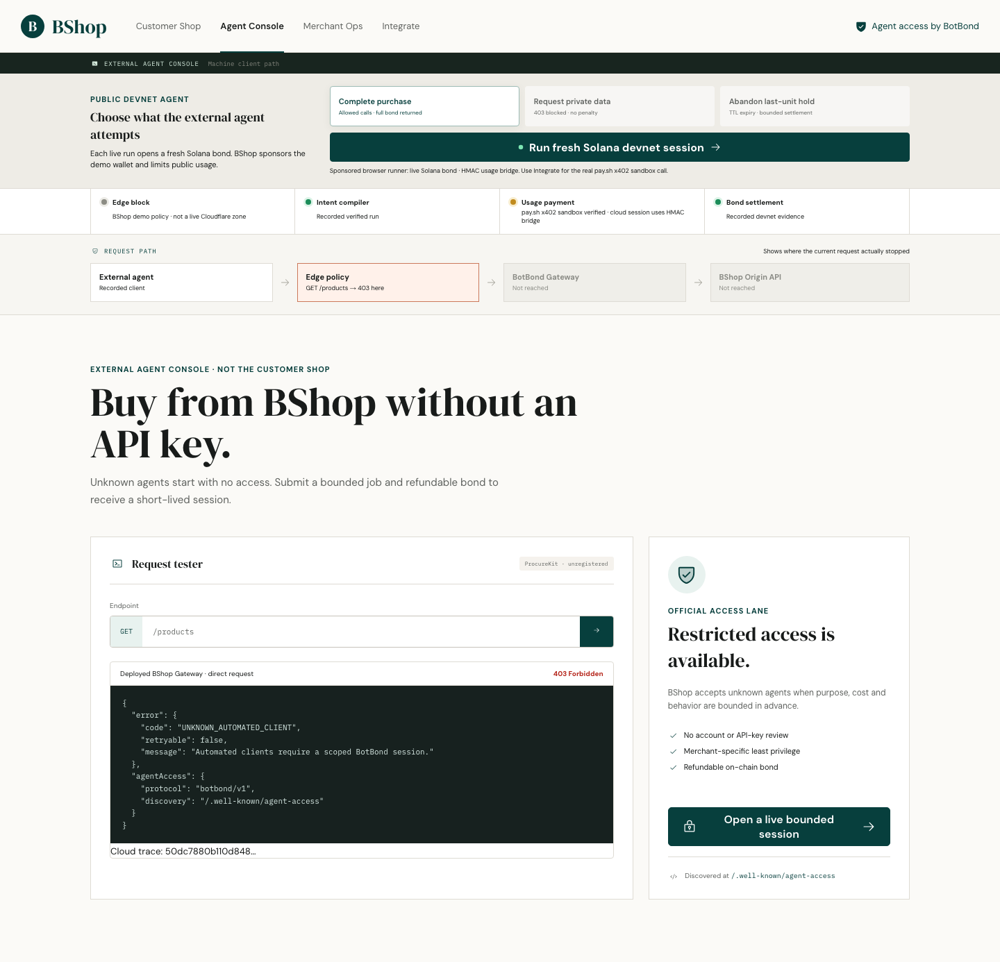
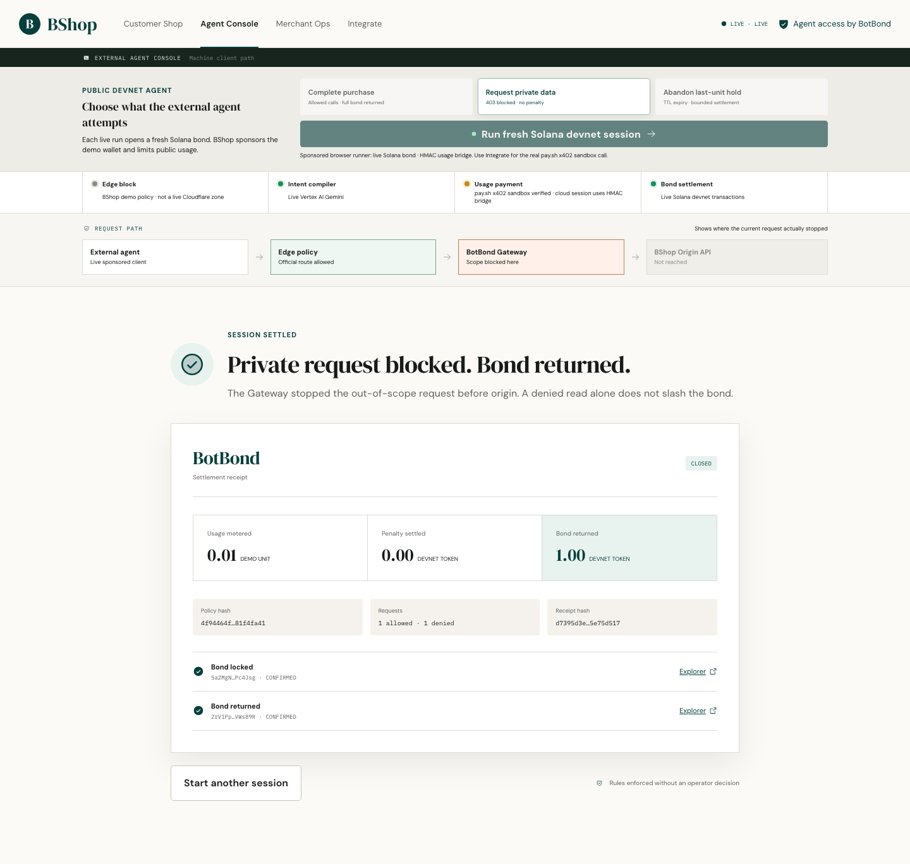
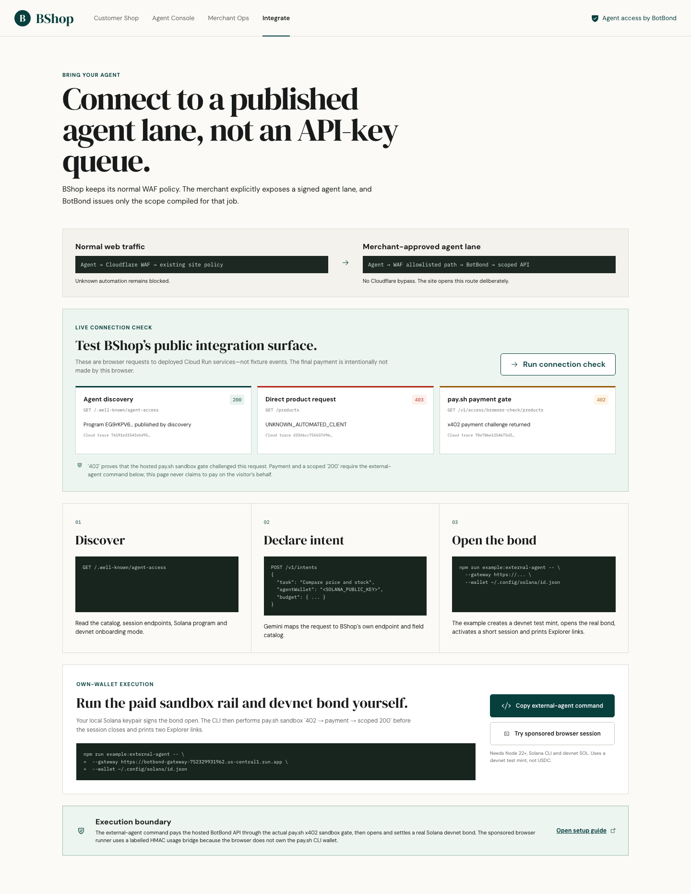
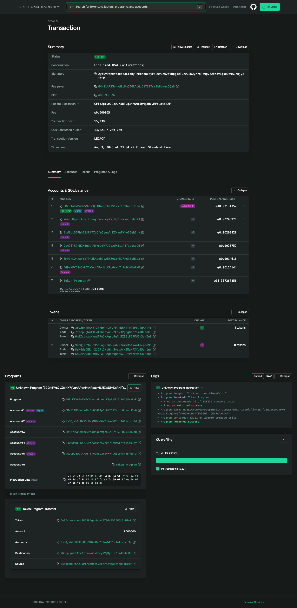

<!-- _class: hero -->

BOTBOND · BONDED AGENT ACCESS

# API key를 기다리는 동안 실시간 기회는 사라집니다

BotBond는 공급자가 직접 설치하는 에이전트 접근 게이트웨이다. 처음 보는 에이전트가 할 일을 설명하면, 공급자는 필요한 API 권한·호출 한도·비용만 담은 짧은 세션을 연다.

예약과 주문처럼 비용이 뒤늦게 생기는 작업은 환불 가능한 온체인 담보로 관리한다.

Permissionless agent onboarding for structured APIs · Google Cloud × Solana

---

01 · WHY NOW

# 에이전트 트래픽은 급증했지만, 접근권은 아직 전부 아니면 전무합니다

<h3>53%</h3>
전체 인터넷 트래픽에서 봇이 차지하는 비중

<h3>40%</h3>
전체 트래픽에서 악성 봇이 차지하는 비중

<h3>+7,851%</h3>
에이전틱 AI 트래픽 증가율

공급자는 unknown automation을 막아야 한다. 그러나 가격·재고·견적처럼 바로 결정해야 하는 데이터를 찾는 정상 에이전트까지 함께 막힌다. API key를 발급할 때까지 기다리면 그 요청의 가치는 이미 사라진다.

Sources: Thales, Imperva Bad Bot Report · HUMAN Security, Agentic AI traffic research

BotBond는 이 사이에 **짧고 제한적인 공식 접근 경로**를 만든다.

---

02 · PRODUCT GAP

# WAF와 API key 사이에는 세 번째 선택지가 필요합니다

| 방식 | 잘하는 일 | 남는 공백 |
|---|---|---|
| Cloudflare / WAF | 비협조적 트래픽 차단 | 협조적인 미등록 에이전트의 온보딩 |
| API key | 장기 고객 인증·청구 | 일회성 접근의 가입·심사 비용 |
| Rate limit | 호출량 통제 | 자연어 목적과 endpoint 의미 |
| pay-per-use | 데이터 사용료 | 예약 등 사후 의무의 담보 |
| Web Bot Auth | 알려진 에이전트의 신원 확인 | 미등록 에이전트가 즉시 책임을 보일 방법 |

WAF는 비협조적 트래픽을 계속 막고, 반복 고객은 API key를 쓴다. BotBond는 그 사이에서 처음 보는 에이전트에게만 목적·비용·시간이 정해진 접근권을 발급한다.

---

03 · MARKET WEDGE & VALUE

# 첫 시장은 검색으로 대체할 수 없는 실시간 구조화 API입니다

<h3>공급자</h3>
가격·재고·견적·예약 API, MCP와 전문 데이터. 일반 경로는 닫은 채 새 수요를 유료 세션으로 받는다.

<h3>에이전트</h3>
구매·조달·여행·운영 에이전트. 가입 대기 대신 지금 필요한 범위와 비용을 먼저 확인한다.

<h3>최종 사용자</h3>
검색 결과가 아닌 실시간 가격·재고·가능 여부로 바로 판단하고 실행한다.

<strong>처음에는 커머스·B2B 조달·MCP 데이터 API</strong>에 집중한다. 이후 여행 좌석, 물류 상태, 시장 데이터, 운영 API까지 같은 접근권 모델로 넓힌다.

블로그 본문이나 학습 크롤링은 첫 시장이 아니다. 실시간 데이터와 희소 자원처럼 요청 하나가 매출·비용·결정에 연결되는 곳부터 시작한다.

---

04 · DEPLOYMENT

# 보안 정책은 유지하고, 에이전트에게만 별도 입구를 엽니다

<h3>일반 자동화 요청</h3><pre>Agent
  → Cloudflare / WAF
    → 기존 정책 또는 차단</pre>
기존 보안 정책은 그대로 둔다.

<h3>운영자가 연 에이전트 경로</h3><pre>Agent
  → WAF allowlisted path
    → BotBond Gateway
  → Scoped Origin API</pre>
작업과 조건에 동의한 에이전트만 이 경로를 쓴다.

WAF를 건너뛰면 공급자는 보안 정책과 접근 통제권을 잃는다. BotBond가 차단을 풀어 주면 악성 자동화도 같은 문을 쓴다. 그래서 BotBond는 WAF 뒤, 운영자가 허용한 경로에만 붙는다. 이 경로에서만 처음 보는 에이전트가 정해진 조건으로 세션을 연다.

일반 웹/API는 계속 닫아두고, <code>/.well-known/agent-access</code>와 범위가 제한된 에이전트 API만 별도 정책으로 연다.

데모의 최초 403은 **BShop edge policy 재현**이며 실제 Cloudflare zone 이벤트가 아닙니다.

---

05 · LIVE GATEWAY

# 실제 요청도 일반 경로에서 멈춥니다

<h3>미등록 agent의 직접 요청</h3>

배포된 BShop Gateway는 <code>GET /products</code>를 <code>403</code>으로 돌려보낸다. Origin API에는 요청이 닿지 않는다.

응답에는 우회 방법 대신 공식 discovery 경로 <code>/.well-known/agent-access</code>가 들어 있다. 에이전트는 이 경로에서 조건을 확인한 뒤에만 다음 단계로 간다.

이 캡처는 live Gateway 요청이다. BShop의 edge policy를 보여 주며, Cloudflare zone 로그라고 주장하지 않는다.

직접 요청 <code>403</code> · discovery 경로 반환 · origin 미도달

---

06 · INTENT COMPILER

# 에이전트는 API 구조 대신 할 일을 설명한다

<h3>에이전트의 작업 요청</h3><blockquote>1,500 이하 노트북의 가격과 재고를 비교하고 마지막 한 대를 예약한 뒤 해제해줘. 판매자 연락처와 리뷰는 필요 없어.</blockquote>

<h3>공급자 정책 초안</h3><pre>{
  "allowed": [
    "GET /products",
    "GET /products/{id}/inventory",
    "POST /reservations",
    "POST /reservations/{id}/release"
  ],
  "max_calls": 25,
  "reservation_ttl": "60s"
}</pre>

같은 가격·재고 비교라도 상점마다 endpoint와 field 이름이 다르다. 에이전트가 API 구조를 직접 추측하면 공급자 문서를 매번 학습해야 하고, 넓은 권한을 요구하기 쉽다. BotBond는 작업 설명과 공급자의 API catalog를 맞춰 필요한 범위만 담은 정책 초안을 만든다.

Gemini는 정책 초안을 만들고, Gateway가 endpoint·field·rate·TTL을 코드로 집행한다. 세션이 시작된 뒤 AI가 권한을 넓히거나 돈을 정산하지 않는다.

---

07 · REQUEST OUTCOMES

# 세션 안에서는 약속한 범위만 실행된다

| 시도 | 결과 | Origin 도달 | 담보 변화 |
|---|---|---:|---:|
| session 없이 재고 조회 | Edge policy `403` | 아니오 | 없음 |
| 허용된 가격·재고 조회 | Gateway `200` | 예, 허용 field만 | 없음 |
| seller contacts 요청 | Scope `403` | 아니오 | 없음 |
| 예약 후 정상 해제 | Session close | 예 | 전액 반환 |
| 예약 후 TTL 방치 | Objective expiry | 예약만 도달 | 0.25 제한 정산 |

**차단은 몰수가 아니다.** 실제 비용을 만든 bonded action의 객관적 위반만 사전에 서명한 상한 안에서 정산한다.

범위 밖 private request는 Gateway에서 차단되고, bond는 전액 반환됩니다.

---

08 · ARCHITECTURE

# 요청부터 정산까지 역할을 나눴다

<pre>Sponsored Browser Agent ── HMAC demo bridge ─┐
                                               ├─ BotBond Gateway · Cloud Run
Own-wallet Agent CLI ── pay.sh x402 sandbox ──┘    ├─ Vertex AI Gemini → policy
                                                     ├─ Firestore → session + evidence
                                                     ├─ deterministic guard → scope / rate / TTL
                                                     ├─ BShop Origin API → price / inventory
                                                     └─ Solana devnet → bond / refund / settlement</pre>

브라우저는 Firestore·서명 키에 직접 접근하지 않는다. **pay.sh 결제는 own-wallet CLI만 수행**하고, browser는 HMAC demo bridge를 명시한다. Solana settlement는 confirmed transaction만 Explorer에 연결한다.

---

09 · IMPLEMENTATION TRUTH

# 지금 동작하는 범위와 데모 경계

| 구성 | 상태 | 검증 증거 |
|---|---|---|
| Vertex AI Gemini | LIVE | 실행마다 새 policy와 hash |
| Cloud Run + Firestore | LIVE | public API, session state, events |
| Solana bond program | LIVE DEVNET | open + refund/settlement tx |
| pay.sh per-call rail | HOSTED SANDBOX | 실제 `402 → pay → 200` |
| Browser session activation | DEMO BRIDGE | HMAC credential, pay.sh verifier 아님 |
| Cloudflare zone/WAF | NOT INTEGRATED | BShop Gateway가 403 정책만 재현 |

온체인 자산은 **devnet test mint**이며 실제 USDC가 아닙니다.

---

10 · PAYMENT RAIL

# 브라우저와 외부 에이전트의 결제 경로를 구분한다

공개 connection check: discovery <code>200</code> · 직접 요청 <code>403</code> · pay.sh gate <code>402</code>

<h3>Browser sponsored run</h3>
Gemini, Gateway, Firestore와 Solana devnet bond를 실제로 실행한다. 사용량 credential은 HMAC demo bridge이며 pay.sh verifier가 아니다.

<h3>Own-wallet agent CLI</h3>
자기 Solana 지갑으로 pay.sh hosted sandbox의 <code>402 → payment → scoped 200</code>을 수행한다. 성공하면 상품 응답과 bond open·정산 Explorer 링크가 출력된다.

서로 다른 rail을 하나의 결제처럼 보이게 만들지 않는다.

---

11 · DEVELOPER FLOW

# 개발자는 discovery에서 세션 발급과 호출을 시작한다

<h3>1. 공개 정보 조회</h3><pre>GET /.well-known/agent-access</pre>
intent·session endpoint, payment rail, Solana program ID와 지원 범위를 받는다.

<h3>2. 작업과 지갑 제출</h3><pre>POST /v1/intents
{ task, wallet, budget }</pre>
Gemini가 공급자 catalog 안에서 policy와 policy hash를 만든다. 에이전트는 담보를 열기 전에 조건을 검토한다.

<h3>3. 세션으로 호출</h3><pre>x-botbond-session-token: &lt;token&gt;
GET /v1/access/:sessionId/products</pre>
정책 hash로 devnet bond를 연 뒤 세션을 발급받는다. 허용된 endpoint만 호출할 수 있다.

<strong>가장 쉬운 실행 방법</strong>은 <code>/integrate</code>의 own-wallet command다. discovery부터 pay.sh sandbox 호출, bond open·close, Explorer URL 출력까지 한 번에 실행한다.

---

12 · ON-CHAIN RECEIPT

# 정산 결과는 Solana Explorer에서 누구나 확인한다

own-wallet 실행의 refund transaction · <code>Success / Finalized</code> · BotBond program log

<h3>확인 순서</h3>

영수증의 <strong>Bond locked</strong> 또는 <strong>Bond returned</strong> 링크를 열어 <strong>Success / Finalized</strong>, transaction signature, 계정 변화와 BotBond program log를 확인한다.

<h3>이번 own-wallet 실행 결과</h3>

pay.sh sandbox 결제 후 상품·재고 호출이 성공했다. usage <code>4000</code>, bond refund <code>1000000</code> atomic units가 기록됐다.

<a href="https://explorer.solana.com/tx/4Pzk9C8wEpdyTDEPPCAPj347AqubcSjS97PY1sse7UwfGE2rYGyuKdQyuzLGh69Kb8XVuSh4CsCbsKBXcLRoFLmJ?cluster=devnet">Bond open Explorer</a> · <a href="https://explorer.solana.com/tx/2yiuVP6nxnW4xdb3LfdhyPhEbKkazeyFaCQvuX62WTUpgjcTDzzZxN2yX7nPb9gVf2EW3vLjseUc9ADXnjy81fFM?cluster=devnet">Refund Explorer</a>

devnet test mint 기준입니다. session credential은 HMAC demo bridge이며, 실제 USDC 거래나 pay.sh 반복 세션 검증을 뜻하지 않습니다.

---

13 · 3-MINUTE DEMO

# 3분 영상에서 제품 흐름을 보여 준다

<h3>1. 사람의 쇼핑</h3>
<code>/shop</code>에서 일반 고객은 기존처럼 상품을 보고 구매한다. BotBond는 이 경로를 바꾸지 않는다.

<h3>2. 에이전트의 첫 요청</h3>
<code>/agent</code>에서 미등록 에이전트가 일반 API를 요청해 <code>403</code>을 받고, discovery 문서에서 공식 에이전트 경로를 찾는다.

<h3>3. 제한된 세션</h3>
에이전트가 작업을 설명하면 policy·담보 조건이 나온다. browser flow는 새 Solana devnet bond와 scoped <code>200</code>, private <code>403</code>을 보여 준다.

<h3>4. 정산과 외부 에이전트</h3>
정상 종료는 반환, 예약 방치는 제한 정산으로 끝난다. 별도 terminal에서는 own-wallet 에이전트가 pay.sh sandbox의 <code>402 → payment → 200</code>을 실행한다.

영상의 browser flow와 own-wallet pay.sh flow는 서로 다른 실행 경로로 표시한다. 하나의 세션처럼 편집하지 않는다.

---

14 · REPRODUCIBLE SUBMISSION

# 심사위원이 직접 확인할 수 있다

<h3>라이브 제품</h3>
<code>botbond-bshop.vercel.app</code>

Shop · Agent · Merchant · Integrate

<h3>내 지갑으로 실행</h3><pre>npm run example:external-agent -- \
  --gateway https://... \
  --wallet ~/.config/solana/id.json</pre>

제출물: 발표 PDF · 재현 가능한 GitHub/README · 3분 실제 온체인 영상 · 심사 기간 접근 가능한 endpoint

Program: <code>EG9r…KaRKR</code> · asset: devnet test mint, not USDC

> 처음 보는 에이전트에게 필요한 것은 즉시 신뢰가 아니라, 범위가 분명하고 정산 규칙이 정해진 접근권입니다.
